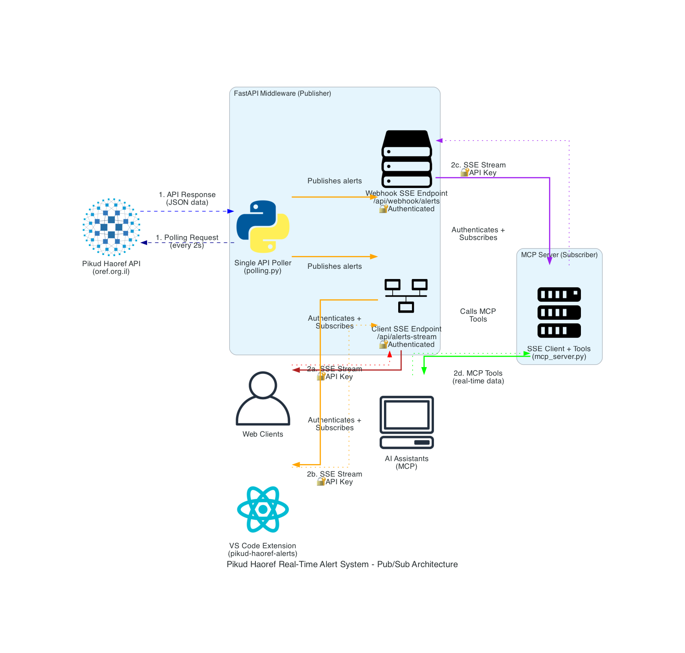

# Pikud Haoref Real-Time Alert System



A comprehensive middleware service and MCP server for accessing Israeli emergency alerts from the official Pikud Haoref (Israeli Home Front Command) API.

## Overview

This project provides **two ways** to access Israeli emergency alert data using a **publish-subscribe architecture**:

1. **FastAPI Middleware Service** - Single source polling with real-time SSE streaming
2. **MCP Server** - Event-driven subscriber for AI assistants (built with FastMCP)

The **FastAPI service** polls the official Pikud Haoref API at `https://www.oref.org.il/WarningMessages/alert/alerts.json` and publishes alerts via Server-Sent Events. The **MCP server** subscribes to this stream, creating an efficient pub-sub system that eliminates duplicate API calls while providing real-time access to emergency alerts including rocket alerts, aerial intrusions, earthquakes, and other emergencies.

## Features

### FastAPI Service Features
- **Single-source polling** of emergency alerts (eliminates duplicate API calls)
- **Real-time SSE streaming** via public webhook endpoint
- **API key authentication** for client endpoints and **geo-restriction** to Israel
- **Docker support** for easy deployment
- **Comprehensive testing** suite

### MCP Server Features
- **Event-driven SSE client** - Subscribes to FastAPI webhook for real-time alerts
- **3 Tools** for AI assistants:
  - `check_current_alerts` - Check for active alerts from subscribed stream
  - `get_alert_history` - Get recent alerts with filtering (limit: 1-50, region filter, **intelligent city matching**)
  - `get_connection_status` - Check SSE subscription connection status
- **2 Resources**:
  - `poha://alerts/recent` - JSON data of recent alerts
  - `poha://alerts/current-status` - System status information
- **Smart City Filtering**:
  - **Exact substring matching** - Find alerts by city name (e.g., "תל אביב" matches all Tel Aviv areas)
  - **Fuzzy matching** - Intelligent matching with threshold 60 for partial/similar names
  - **Multi-city support** - Search multiple cities simultaneously
  - **Hebrew city names** - Optimized for Hebrew location names from the API
- **Built with FastMCP** following proven patterns
- **Automatic reconnection** and error handling for SSE connections

## Quick Start

### Option 1: FastAPI Service (Requires API Key)

1. **Install dependencies:**
```bash
pip install -r requirements.txt
```

2. **Configure environment** (create `.env` file):
```env
API_KEY=your-secure-api-key-here  # Required for FastAPI SSE endpoints
GEOIP_DB_PATH=/path/to/GeoLite2-Country.mmdb  # Optional for geo-restriction
```

3. **Run the service:**
```bash
# Start all 3 services with Docker (API:8000, MCP:8001, SSE:8002)
make up

# View logs in real-time
make logs

# Check status
make status
```

4. **Connect to the stream:**
```bash
curl -H "X-API-Key: your-key" http://localhost:8000/api/alerts-stream
```

### Option 2: MCP Server (No API Key Required)

1. **Install dependencies:**
```bash
pip install -r requirements.txt
```

2. **Configure your MCP client** (Claude Desktop, etc.):

For **Claude Desktop**, add to `~/Library/Application Support/Claude/claude_desktop_config.json`:
```json
{
  "mcpServers": {
    "poha-alerts": {
      "type": "http",
      "url": "http://127.0.0.1:8001/mcp"
    }
  }
}
```

**Cursor IDE**, add to `.cursor/mcp.json` in your project:
```json
{
  "mcpServers": {
    "poha-alerts": {
      "type": "http", 
      "url": "http://127.0.0.1:8001/mcp"
    }
  }
}
```

3. **Start the services:**
```bash
# Start all 3 services (FastAPI:8000 + MCP:8001 + SSE Gateway:8002)
make up

# Alternative: Individual service management
make app-restart    # Restart just FastAPI
make mcp-restart    # Restart just MCP server  
make logs-app       # View FastAPI logs only
make logs-mcp       # View MCP server logs only
```

**Access URLs after startup:**
- FastAPI + Swagger UI: http://localhost:8000/docs
- MCP Server: http://localhost:8001/mcp  
- SSE Gateway: http://localhost:8002

4. **Start using** - The server will be available as "Pikud Haoref Alert System" in your MCP client via HTTP transport.

## API Endpoints (FastAPI Service)

### `GET /`
Basic status endpoint.

### `GET /api/alerts-stream`
**Headers:** `X-API-Key: your-key`

Server-Sent Events stream for real-time alerts (authenticated endpoint). Returns:
- `event: new_alert` - When a new alert is detected
- `: keep-alive` - Periodic keep-alive messages

### `GET /api/webhook/alerts`
**Headers:** `X-API-Key: your-key`

Internal SSE webhook endpoint for services like the MCP server. Streams the same alert data as the client endpoint and requires the same API key authentication for security. Designed for server-to-server communication.

Example response for both endpoints:
```
event: new_alert
data: {"id": "12345", "data": ["Tel Aviv", "Ramat Gan"], "cat": "1", "title": "Rocket Alert", "desc": "Immediate shelter required"}

: keep-alive
```

## MCP Tools Usage

### Check Current Alerts
```
Use the check_current_alerts tool to see if there are any active emergency alerts from the subscribed SSE stream.
```

### Get Alert History MCP
```
Use get_alert_history with limit=5 to get the 5 most recent alerts from the API.
Use get_alert_history with region="Tel Aviv" to get alerts for a specific region.
Use get_alert_history with cities=["תל אביב"] to get alerts for Tel Aviv (all areas).
Use get_alert_history with cities=["תל אביב", "חיפה"] to get alerts for multiple cities.
Use get_alert_history with cities=["תל אביב מרכז"] for specific areas with fuzzy matching.
```

**City Filtering Examples:**
- `cities=["תל אביב"]` - Finds all Tel Aviv areas (דרום העיר ויפו, מזרח, מרכז העיר, עבר הירקון)
- `cities=["חיפה"]` - Finds all Haifa-related alerts
- `cities=["תל אביב", "חיפה", "ירושלים"]` - Multiple cities simultaneously
- `cities=["תל אביב מרכז"]` - Fuzzy matches to "תל אביב - מרכז העיר"
- `cities=["all"]` - No city filtering (shows all alerts)

### Check Connection Status
```
Use get_connection_status to verify the SSE subscription connection and see system health.
```

## Architecture

The system uses a **publish-subscribe architecture** with the following components:

1. **Pikud Haoref API** - External data source (government emergency alerts)
2. **FastAPI Middleware** - Single source polling + SSE publisher (polls every 2 seconds)
3. **MCP Server** - SSE subscriber + tool provider for AI assistants
4. **Client Applications** - Web frontends, mobile apps, AI assistants, or other services

```
Pikud Haoref API ←→ [Single Poller] ←→ FastAPI Middleware ←→ [SSE Stream] ←→ MCP Server → AI Assistants
                                              ↓
                                          [SSE Stream] ←→ Web Clients
```

**Key Benefits:**
- ✅ **50% reduction** in API calls (single polling source)
- ✅ **Real-time propagation** of alerts via SSE
- ✅ **Event-driven architecture** for better scalability
- ✅ **Automatic reconnection** for robust SSE connections

**Visual Diagram:** Run `python diagram.py` to generate `poha_sse_architecture.png` showing the complete system architecture.

## Security Features

### API Key Authentication (Required for All Endpoints)
**Important:** API key authentication is **required for both SSE endpoints** for security.

- **Both SSE endpoints** require API key authentication via `X-API-Key` header
- **MCP server** connects with authentication to the internal webhook endpoint
- **Same API key** used for both client and internal service authentication

### Geo-Restriction (Optional)
Configure `GEOIP_DB_PATH` to restrict access to Israeli IP addresses only:
1. Sign up at [MaxMind](https://www.maxmind.com/en/geolite2/signup)
2. Download `GeoLite2-Country.mmdb`
3. Set `GEOIP_DB_PATH` in your `.env` file


## Development

### Project Structure
```
poha-real-time-alert-system/
├── src/                     # Main source code
│   ├── core/               # Core MCP functionality
│   │   ├── mcp_server.py   # MCP server implementation
│   │   ├── state.py        # Application state management
│   │   └── alert_queue.py  # Alert queue management
│   ├── api/                # FastAPI services
│   │   ├── main.py         # FastAPI application entry point
│   │   └── sse_gateway.py  # SSE gateway for VSCode extension
│   ├── services/           # Business logic
│   │   ├── polling.py      # Core API polling logic
│   │   └── sse.py          # Server-Sent Events implementation
│   └── utils/              # Utilities
│       ├── security.py     # Authentication and geo-restriction
│       └── geolocation.py  # Geo-IP functionality
├── docker/                 # Docker configuration
│   ├── Dockerfile         # Main FastAPI container
│   ├── mcp.Dockerfile     # MCP server container
│   └── docker-compose.yml # Multi-service setup
├── scripts/               # Utility scripts
│   ├── start_mcp.sh       # MCP server startup script
│   └── diagram.py         # Architecture diagram generator
├── tests/                 # Comprehensive test suite
├── vscode-extension/      # VSCode extension for alerts
├── conftest.py           # Test configuration
├── pytest.ini           # Test settings
├── Makefile             # Docker management commands
├── requirements.txt     # Python dependencies
├── README.md           # This file
└── .gitignore         # Git ignore rules
```

### Testing
```bash
# Run tests in Docker
make test

# Or run tests locally (requires Python setup)
pytest
pytest tests/test_api.py -v
pytest --cov=. tests/
```

### Local Development (Alternative to Docker)
If you prefer to develop without Docker:

```bash
# Install dependencies
pip install -r requirements.txt

# Start services individually (3 separate terminals)
python -m uvicorn src.api.main:app --host 0.0.0.0 --port 8000 --reload  # Terminal 1
python -m src.core.mcp_server                                            # Terminal 2  
python -m uvicorn src.api.sse_gateway:app --host 0.0.0.0 --port 8002     # Terminal 3
```

**Recommended:** Use Docker with `make up` for easier development.

### Dependencies
- **Core:** `fastapi`, `uvicorn`, `httpx`, `python-dotenv`
- **Security:** `geoip2`, `slowapi`
- **MCP:** `fastmcp`, `fuzzywuzzy`, `python-Levenshtein`
- **Testing:** `pytest`, `pytest-asyncio`, `respx`

## Docker Deployment

### Services Overview
The system runs **3 Docker containers** with the following ports:

| Service | Container | Port | Description |
|---------|-----------|------|-------------|
| **FastAPI** | `poha-app` | `8000` | Main API service, alert polling, SSE webhooks |
| **MCP Server** | `poha-mcp-server` | `8001` | Model Context Protocol server for AI assistants |
| **SSE Gateway** | `poha-sse-gateway` | `8002` | SSE gateway for VSCode extension |

**Access URLs:**
- **FastAPI Swagger**: http://localhost:8000/docs
- **MCP Endpoint**: http://localhost:8001/mcp
- **SSE Gateway**: http://localhost:8002

### Quick Start with Make
```bash
# Start all 3 services (FastAPI + MCP + SSE Gateway)
make up

# View logs from all services
make logs

# Check status and ports
make status

# Stop all services
make down

# Restart with rebuild
make restart
```

### Manual Docker Commands (Alternative)
```bash
# Build and run with docker-compose (all 3 services)
cd docker
docker-compose up -d

# Or individual containers
docker build -f docker/Dockerfile -t poha-api .
docker build -f docker/mcp.Dockerfile -t poha-mcp .
docker run -d -p 8000:8000 -e API_KEY=your-key poha-api
docker run -d -p 8001:8001 -e API_KEY=your-key poha-mcp
```

## Data Source

- **API:** `https://www.oref.org.il/WarningMessages/alert/alerts.json`
- **Provider:** Israeli Government (Pikud Haoref - Home Front Command)
- **Coverage:** All emergency alerts in Israel
- **Update Frequency:** Every 2 seconds
- **Data Types:** Rocket alerts, aerial intrusions, earthquakes, emergency announcements

## Use Cases

- **Emergency Response Teams** - Real-time alert monitoring
- **News Organizations** - Breaking news automation
- **Israeli Residents** - Personal safety notifications
- **Researchers** - Emergency pattern analysis
- **AI Assistants** - Contextual emergency information
- **Mobile Apps** - Push notification services
- **Smart Home Systems** - Automated responses to alerts

## Configuration Examples

### FastAPI Service `.env` File
```env
# Required for FastAPI SSE endpoints
API_KEY=poha-test-key-2024-secure

# Optional - Enable geo-restriction
GEOIP_DB_PATH=/path/to/GeoLite2-Country.mmdb
```


## Troubleshooting

### Common Issues

1. **"API key is missing"** - Ensure `X-API-Key` header is set for both client and webhook endpoints
2. **MCP connection fails** - Check:
   - Python path in MCP config (use full venv path if needed: `/path/to/venv/bin/python`)
   - API_KEY environment variable is set correctly
   - FastAPI service is running on localhost:8000
   - Restart your MCP client (Cursor, Claude Desktop, etc.)
   - Alternative: Use the provided `start_mcp.sh` script as the command
3. **Connection timeouts** - Check your internet connection and firewall settings
4. **Geo-restriction errors** - Verify `GeoLite2-Country.mmdb` path and file permissions
5. **SSE authentication fails** - Verify API key matches between FastAPI service and MCP config
6. **City filtering not working** - 
   - Use Hebrew city names (e.g., "תל אביב" not "Tel Aviv")
   - Check exact city names in alert history first: `cities=["all"]`
   - Try broader names for fuzzy matching: "תל אביב" instead of "תל אביב - מרכז העיר"
7. **ModuleNotFoundError: No module named 'fuzzywuzzy'** - 
   - Rebuild Docker containers: `docker-compose build --no-cache`
   - Install dependencies: `pip install fuzzywuzzy python-Levenshtein`

### Logs
Both services provide detailed logging. Check logs for:
- API polling status
- SSE client connections and authentication
- MCP server webhook connection status
- Error messages
- Security events

## Contributing

1. Fork the repository
2. Create a feature branch
3. Add tests for new functionality
4. Ensure all tests pass
5. Submit a pull request

## License

This project accesses public emergency alert data from the Israeli government. The service is designed for legitimate emergency preparedness and news reporting purposes.

## Disclaimer

This service provides access to official Israeli emergency alert data but is not affiliated with or endorsed by the Israeli government or Pikud Haoref. Always follow official emergency procedures and consult official sources for critical safety information.